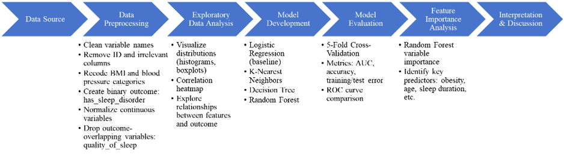

```{r setup, include=FALSE}
knitr::opts_chunk$set(echo = FALSE,
                      warning = FALSE,
                      message = FALSE,
                      fig.width = 6,
                      fig.height = 3 )

library(ggplot2)

theme_set(
  theme_minimal(base_size = 10) +
    theme(
      plot.title = element_text(size = 12, face = "bold", hjust = 0.5),
      axis.title.x = element_text(size = 9),
      axis.title.y = element_text(size = 9),
      axis.text = element_text(size = 8),
      strip.text = element_text(size = 8, face = "plain"),
      legend.text = element_text(size = 8),
      legend.title = element_text(size = 9),
      plot.margin = margin(2, 2, 2, 2, unit = "pt")
    )
)
```

## 1. Introduction

Sleep disorders, including insomnia and sleep apnea, are one of the most widespread public health concerns that significantly impact individuals' physical and mental well-being. Poor sleep quality is associated with a higher risk of chronic diseases such as hypertension, obesity, diabetes, and depression, contributing to increased healthcare burdens and reduced quality of life. According to the CDC (2020), 14.5% of U.S. adults report difficulty falling asleep, while 17.8% struggle to stay asleep, highlighting the urgent need for effective screening and intervention strategies.

Given the multifactorial nature of sleep health, utilizing demographic, lifestyle, and physiological data to predict sleep disorders can be used for early detection and personalized health management. In this project, we developed a predictive model using a publicly available Sleep Health and Lifestyle dataset to identify individuals at risk of sleep disorders based on easily accessible health indicators.

Our approach involved systematic data preprocessing, exploratory analysis, and the application of various machine learning classification methods. Among the models evaluated, the Random Forest algorithm demonstrated superior predictive performance, achieving an AUC of 0.939 and accuracy of 0.937. Variable importance analysis further revealed that obesity (BMI category), age, and sleep duration were the most influential predictors, consistent with existing clinical knowledge.

These findings underscore the potential of machine learning models in enhancing sleep disorder screening efforts, particularly through the integration of biometric and lifestyle factors. By identifying high-risk individuals, such models can support targeted public health interventions aimed at improving sleep health outcomes and reducing the associated health concerns.

## 2. Related Work

Prior studies have documented the global burden of sleep disorders and their links to obesity, stress, and sedentary lifestyle. According to the Centers for Disease Control and Prevention (CDC), approximately 14.5% of U.S. adults report difficulty falling asleep, while 17.8% report trouble staying asleep. Globally, research by Morin et al. (2022) estimates that around 10% of adults meet criteria for insomnia disorder.

Recent advancements in machine learning have been applied to predict sleep disorders, such as obstructive sleep apnea (OSA) and insomnia. Many studies utilize data from wearable devices, including heart rate and activity levels, to train complex models like convolutional neural networks (CNNs) and ensemble learning techniques. For instance, Kılıç et al. employed CNNs on wearable data to predict sleep quality, achieving high accuracy but requiring specialized hardware and data collection methods.

Other research has focused on developing machine learning algorithms based on questionnaire responses and demographic information. Lee et al. introduced the SLEEPS model, which uses a simplified questionnaire and extreme gradient boosting (XGBoost) to predict the risk of OSA, comorbid insomnia and sleep apnea (COMISA), and insomnia, achieving area under the receiver operating characteristic curve (AUROC) values above 0.897. While effective, this approach still requires specific questionnaires and may not be easily generalizable across different populations.

In contrast, our study utilizes a publicly available dataset comprising self-reported demographic, biometric, and lifestyle variables to predict the presence of sleep disorders. By applying conventional machine learning models—Logistic Regression, K-Nearest Neighbors, Decision Tree, and Random Forest—we aim to develop an interpretable and scalable approach suitable for large-scale public health applications. This method emphasizes the use of readily available data, reducing the need for specialized equipment or extensive questionnaires, thereby facilitating broader implementation in diverse settings.

## 3. Methods

We formulated a binary classification task to predict whether an individual has a sleep disorder using demographic, biometric, and lifestyle variables. The binary outcome variable `has_sleep_disorder` was derived by collapsing the original `sleep_disorder` into two classes: “Yes” (for insomnia or sleep apnea) and “No”.

Predictors included both continuous and categorical variables, such as age, heart_rate, bmi_category, gender, and occupation. Based on prior knowledge, we excluded `quality_of_sleep` due to its conceptual overlap with the outcome. Continuous variables were normalized using Min-Max scaling.

After data cleaning and recoding, the dataset was randomly split into 80% training and 20% testing sets. We trained four supervised learning models: 

- Logistic Regression, chosen for its interpretability and role as a baseline classifier.
- K-Nearest Neighbors (KNN), a non-parametric method sensitive to local structure.
- Decision Tree, which provides interpretable decision rules and handles non-linearities.
- Random Forest, an ensemble method that improves generalization by aggregating multiple trees.

All models were evaluated using five-fold cross-validation. Model performance was assessed using AUC, accuracy, training/test error, and ROC curves. Feature importance was analyzed using the Random Forest model to interpret key predictors.

An overview of the full analytical workflow is presented in Figure 1.

```{r methods, fig.cap="Conceptual workflow of the modeling process.", fig.align='center'}

```

## 4. Data and Experiment Setup

### 4.1 Data Source and Available Variables

We used the *Sleep Health and Lifestyle Dataset* by Laksika Tharmalingam.

The dataset contains 374 observations and 13 features, including demographic information (age, gender), lifestyle factors (physical activity, alcohol consumption, smoking status), and health metrics (BMI, blood pressure, stress levels).

The main outcome variable is sleep_disorder (categorized as None, Insomnia, Sleep Apnea). Predictor variables include age, bmi, physical_activity_level, stress_level, and others.

### 4.2 Data Preprocessing

```{r}
library(tidyverse)
library(janitor)
library(readr)

df <- read_csv("Sleep_health_and_lifestyle_dataset.csv")

df <- df %>% clean_names() ## Clean column names
```

We began by systematically cleaning and preprocessing the dataset to ensure data quality and consistency.

First, variable names were standardized using the `clean_names()` function to eliminate formatting inconsistencies and facilitate downstream analysis.

Then we excluded the person ID variable, as it served solely as an identifier and had no predictive value for the outcomes of interest.

Several key variables were recoded to simplify the data structure and reduce sparsity:

- `bmi_category`: Categories labeled "Normal" and "Normal Weight" were merged into a single "Normal" group, while "Obese" and "Overweight" were consolidated into an "Obese" group.

- `blood_pressure`: Blood pressure readings were classified into two categories—"Normal" and "Hypertension"—based on elevated systolic blood pressure thresholds commonly used in clinical guidelines.

Additionally, we recoded the `sleep_disorder` variable to create a binary outcome to simplify the prediction task and focus on distinguishing individuals with any form of sleep disorder from those without. Participants who reported no sleep disorder were categorized as "No", while those who reported either insomnia or sleep apnea were categorized as "Yes".

And the variable `quality_of_sleep` was excluded from modeling because it may be a downstream effect of sleep disorders, making it inappropriate as a predictor in our context.

```{r}
df <- df %>%
  mutate(sleep_disorder = factor(sleep_disorder, levels = c("None", "Insomnia", "Sleep Apnea"),
                                 labels = c("None", "Insomnia", "Sleep_Apnea"))) %>%
  mutate(bmi_category = case_when(
    tolower(bmi_category) %in% c("normal", "normal weight") ~ "Normal",
    tolower(bmi_category) %in% c("obese", "overweight") ~ "Obese",
    TRUE ~ NA_character_
  )) %>%
  mutate(bmi_category = factor(bmi_category, levels = c("Normal", "Obese"))) %>%
  mutate(blood_pressure = case_when(
    str_detect(blood_pressure, "14[0-9]/|1[5-9]") ~ "Hypertension",
    TRUE ~ "Normal"
  ) %>% factor(levels = c("Normal", "Hypertension"))) %>%
  mutate(has_sleep_disorder = ifelse(sleep_disorder == "None", "No", "Yes") %>% 
           factor(levels = c("No", "Yes"))) %>%
  mutate(across(where(is.character), as.factor)) %>%
  select(-quality_of_sleep) %>%
  drop_na()
```

Finally, Min-Max normalization was applied to all continuous variables, scaling them to a [0,1] range to ensure comparability across features and improve the performance of machine learning algorithms.

```{r}
library(janitor)

numeric_vars <- df %>%
  select(where(is.numeric)) %>%
  names()

numeric_vars <- setdiff(numeric_vars, "person_id")

df_sd <- df
df_sd[numeric_vars] <- scale(df[numeric_vars]) 
```

### 4.3 Descriptive Statistics and Exploratory Analysis

To gain an initial understanding of the dataset, we conducted exploratory data analysis (EDA) on both numeric and categorical variables. The goal was to assess variable distributions, detect potential outliers, and explore associations with the presence of sleep disorders.

Conceptual workflow of the modeling process.

#### Numeric Variables

We first examined the distribution of all numeric variables, including age, BMI, sleep duration, stress level, physical activity level, and daily steps. Histograms revealed that several variables, such as sleep duration and physical activity level, exhibited clustering around certain integer values, suggesting self-reported tendencies. Boxplots were used to further inspect the spread and potential outliers across these variables.

```{r eda-histograms, fig.cap="Histograms of continuous variables.", fig.align='center'}
df_long <- df %>%
  select(all_of(numeric_vars)) %>%
  pivot_longer(everything(), names_to = "Variable", values_to = "Value")

ggplot(df_long, aes(x = Value)) +
  geom_histogram(bins = 15, fill = "#74a9cf", color = "white") +
  facet_wrap(~ Variable, scales = "free", ncol = 3) +
  labs(x = NULL, y = "Frequency")
```

```{r eda-boxplots, fig.cap="Boxplots of continuous variables.", fig.align='center'}
ggplot(df_long, aes(x = Variable, y = Value)) +
  geom_boxplot(show.legend = FALSE, fill = "#74a9cf") +
  facet_wrap(~Variable, scales = "free", ncol = 3) + 
  theme(
    strip.text = element_blank()
  ) +
  labs(x = NULL, y = "Observed Value")
```

In addition, we computed pairwise Pearson correlations among numeric features and visualized the correlation matrix using a heatmap. This analysis helped identify redundant or highly correlated predictors, such as between BMI and sleep duration, which may inform model regularization or feature selection.

```{r correlation-heatmap, fig.cap="Correlation heatmap of numeric variables using Pearson coefficients.", fig.align='center'}
library(corrplot)
cor_matrix <- df %>%
  select(all_of(numeric_vars)) %>%
  cor(use = "complete.obs")

corrplot(cor_matrix, method = "color", type = "upper", 
         tl.col = "black", tl.srt = 45, addCoef.col = "black",
         tl.cex = 0.6, number.cex = 0.6,
         cl.cex = 0.6, cl.ratio = 0.15, cl.align.text = "l")
```

#### Categorical Variables and Sleep Disorder Status

We explored the relationship between categorical predictors (e.g., gender, occupation, BMI category, blood pressure category) and the binary outcome variable `has_sleep_disorder` ("Yes"/"No"). Grouped bar charts were used to visualize conditional distributions of sleep disorder status across each categorical variable. These visualizations provided preliminary insights into potential associations between demographic/lifestyle factors and sleep health outcomes, which were further assessed in the modeling stage.

```{r sleep-binary-barplot, fig.cap="Proportion of sleep disorder status across categorical variables.", fig.align='center', fig.pos='htbp', fig.width=5, fig.height=3.5}

library(ggplot2)
library(dplyr)
library(tidyr)
library(scales)

categorical_vars <- df %>%
  select(where(~ is.character(.) | is.factor(.))) %>%
  names() %>%
  setdiff("patient_id")

df_long_categorical <- df %>%
  select(all_of(categorical_vars), has_sleep_disorder, -sleep_disorder) %>%
  pivot_longer(
    cols = -has_sleep_disorder,
    names_to = "Variable",
    values_to = "Category"
  ) %>%
  group_by(Variable, Category, has_sleep_disorder) %>%
  summarise(n = n(), .groups = "drop") %>%
  group_by(Variable, Category) %>%
  mutate(prop = n / sum(n)) %>%
  ungroup()

ggplot(df_long_categorical, 
       aes(x = Category, y = prop, fill = has_sleep_disorder)) +
  geom_col(position = position_dodge(preserve = "single")) +
  facet_wrap(~ Variable, scales = "free_x", ncol = 2) +
  scale_y_continuous(labels = percent_format(accuracy = 1), limits = c(0, 1)) +
  scale_fill_manual(values = c("Yes" = "#f4a582", "No" = "#74a9cf")) +
  labs(y = "Proportion (%)", x = NULL) +
  theme(
    axis.text.x = element_text(angle = 30, hjust = 1),
    legend.position = "bottom")
```

```{r sleep-binary-boxplot, fig.cap="Distribution of Numeric Variables by Sleep Disorder.", fig.pos='htbp', fig.align='center'}

df_long_numeric <- df %>%
  select(all_of(numeric_vars), has_sleep_disorder) %>%
  pivot_longer(
    cols = -has_sleep_disorder,
    names_to = "Variable", 
    values_to = "Value"
  )

ggplot(df_long_numeric, aes(x = has_sleep_disorder, y = Value, fill = has_sleep_disorder)) +
  geom_boxplot(show.legend = FALSE) +
  facet_wrap(~ Variable, scales = "free_y", ncol = 3) +  
  scale_fill_manual(values = c("Yes" = "#f4a582", "No" = "#74a9cf")) +
  labs(x = NULL, y = "Observed Value") 
```


### 4.4 Benchmark Model Definition

For this study, we selected **logistic regression** as our benchmark model. Logistic regression is widely used in public health research due to its simplicity, interpretability, and strong theoretical foundation. As a generalized linear model, it offers insights into the direction and strength of association between predictors and the outcome variable, making it a natural starting point for classification tasks.

Establishing logistic regression as the baseline model allows for a meaningful comparison of more complex classification methods—including decision trees, K-nearest neighbors (KNN), and random forests—in terms of accuracy, AUC, and other relevant performance metrics.

To ensure a fair and unbiased evaluation, all models were trained and tested under identical conditions using five-fold cross-validation.

## 5. Results

We evaluated four classification models—Logistic Regression, K-Nearest Neighbors (KNN), Decision Tree, and Random Forest—using five-fold cross-validation. Each model's performance was assessed using AUC, accuracy, cross-validation (CV) error, training error, and test error.

```{r split_data}
library(caret)
set.seed(123)
train_index <- createDataPartition(df_sd$has_sleep_disorder, 
                                 p = 0.8, 
                                 list = FALSE)
train <- df_sd[train_index, ]
test <- df_sd[-train_index, ]
```

```{r modeling_setup}
ctrl <- trainControl(method = "cv", number = 5, classProbs = TRUE, summaryFunction = multiClassSummary, savePredictions = "final")
```

```{r models, results='hide'}
library(rpart)

log_model <- train(has_sleep_disorder ~ . - person_id - sleep_disorder, data = train, method = "multinom", trControl = ctrl, tuneLength = 10)

knn_model <- train(has_sleep_disorder ~ . - person_id - sleep_disorder, data = train, method = "knn", trControl = ctrl, tuneLength = 10)

tree_model <- train(has_sleep_disorder ~ . - person_id - sleep_disorder, data = train, method = "rpart", trControl = ctrl, tuneLength = 10)

rf_model <- train(has_sleep_disorder ~ . - person_id - sleep_disorder, data = train, method = "rf", trControl = ctrl, tuneLength = 10)
```

```{r compare_models}
results <- resamples(list(
  Logistic = log_model,
  KNN = knn_model,
  Tree = tree_model,
  RF = rf_model
))
```

### 5.1 Model Performance Comparison

We evaluated four classification models—Logistic Regression, K-Nearest Neighbors (KNN), Decision Tree, and Random Forest—using five-fold cross-validation to predict the presence of sleep disorders. Performance metrics, including average AUC, accuracy, cross-validation error, training error, and testing error, are summarized in Table 1.

```{r table-performance-summary, results='asis'}
cv_results <- summary(resamples(list(
  Logistic = log_model,
  KNN = knn_model,
  Tree = tree_model,
  RF = rf_model
)))

train_errors <- sapply(list(log_model, knn_model, tree_model, rf_model), function(model) {
  1 - mean(predict(model, train) == train$has_sleep_disorder)
})

test_errors <- sapply(list(log_model, knn_model, tree_model, rf_model), function(model) {
  1 - mean(predict(model, test) == test$has_sleep_disorder)
})

results_table <- data.frame(
  Model = c("Logistic", "KNN", "Tree", "RF"),
  AUC = cv_results$statistics$AUC[, "Mean"],
  Accuracy = cv_results$statistics$Accuracy[, "Mean"],
  CV_Error = 1 - cv_results$statistics$Accuracy[, "Mean"],
  Train_Error = train_errors,
  Test_Error = test_errors
)

formatted_table <- results_table %>%
  mutate(across(where(is.numeric), ~ round(., 3))) %>%  
  rename(
    `CV Error` = CV_Error,
    `Train Error` = Train_Error,
    `Test Error` = Test_Error
  )

knitr::kable(
  formatted_table,
  caption = "Performance comparison of four classification models predicting sleep disorder status."
)

```

Random Forest exhibited the strongest overall performance, achieving the highest test accuracy (0.939) and the lowest cross-validation error (0.063). Logistic Regression followed closely, demonstrating both interpretability and competitive AUC (0.931) with minimal error. In contrast, Decision Tree and KNN showed relatively lower accuracy and AUC values, indicating more limited predictive capability under cross-validation.

Among the four models evaluated, Random Forest consistently outperformed others across all metrics, achieving the highest AUC (0.939), accuracy (0.937), and lowest errors. Logistic Regression followed closely with strong performance and interpretability. KNN and Decision Tree models exhibited relatively lower accuracy and higher error rates, particularly in test error (0.108), indicating potential issues with generalization.


### 5.2 ROC Curve Evaluation

To provide a visual comparison, we generated ROC curves for all models by pooling predictions from the five cross-validation folds and computing a single ROC per model (Figure 7). This approach smooths out fold-level variation and highlights general trends in model discrimination performance.
```{r ROC_Plot_Facet, fig.cap="ROC curves averaged over 5-fold cross-validation (pooled predictions).", fig.width=4, fig.height=4, fig.align='center'}
library(pROC)

log_preds <- log_model$pred
knn_preds <- knn_model$pred
tree_preds <- tree_model$pred
rf_preds <- rf_model$pred

roc_log <- roc(log_preds$obs, log_preds$Yes)
roc_knn <- roc(knn_preds$obs, knn_preds$Yes)
roc_tree <- roc(tree_preds$obs, tree_preds$Yes)
roc_rf <- roc(rf_preds$obs, rf_preds$Yes)

auc_log <- auc(roc_log)
auc_knn <- auc(roc_knn)
auc_tree <- auc(roc_tree)
auc_rf <- auc(roc_rf)

# Pooled ROC from saved model predictions
roc_df <- bind_rows(
  data.frame(fpr = 1 - roc_log$specificities, tpr = roc_log$sensitivities, model = "Logistic"),
  data.frame(fpr = 1 - roc_knn$specificities, tpr = roc_knn$sensitivities, model = "KNN"),
  data.frame(fpr = 1 - roc_tree$specificities, tpr = roc_tree$sensitivities, model = "Decision Tree"),
  data.frame(fpr = 1 - roc_rf$specificities, tpr = roc_rf$sensitivities, model = "Random Forest")
)

# AUC label positions (top-left corner of each panel)
auc_labels <- data.frame(
  model = c("Logistic", "KNN", "Decision Tree", "Random Forest"),
  x = 0.05, y = 0.1,
  label = c(
    paste0("AUC = ", round(auc_log, 3)),
    paste0("AUC = ", round(auc_knn, 3)),
    paste0("AUC = ", round(auc_tree, 3)),
    paste0("AUC = ", round(auc_rf, 3))
  )
)

# Custom colors
model_colors <- c(
  "Logistic" = "#74a9cf",
  "KNN" = "#92c5de",
  "Decision Tree" = "#f4a582",
  "Random Forest" = "#ca0020"
)

# Plot
ggplot(roc_df, aes(x = fpr, y = tpr, color = model)) +
  geom_line(size = 1.1) +
  geom_abline(linetype = "dashed", color = "gray") +
  facet_wrap(~ model, ncol = 2) +
  scale_color_manual(values = model_colors) +
  geom_text(data = auc_labels, aes(x = x, y = y, label = label), 
            inherit.aes = FALSE, size = 3.2, hjust = 0, color = "black") +
  labs(
    x = "False Positive Rate (1 - Specificity)",
    y = "True Positive Rate (Sensitivity)"
  ) +
  theme_minimal(base_size = 10) +
  theme(
    legend.position = "none",
    strip.text = element_text(size = 10, face = "bold"),
    axis.title = element_text(size = 9),
    axis.text = element_text(size = 8)
  )
```

Both Random Forest and Logistic Regression produced ROC curves with high sensitivity across all thresholds, in line with their strong average AUC scores from cross-validation. However, the ROC curve for KNN appeared more optimistic than its average AUC in Table 1 would suggest.

This discrepancy arises because the ROC plots are generated by aggregating all predictions and then computing a single ROC curve—this often yields slightly higher AUC values, especially for models like KNN that may benefit from favorable prediction distributions in a subset of folds.

To ensure statistical rigor, we emphasize that all numerical comparisons and conclusions are based on the cross-validated mean AUCs and error rates reported in Table 1. The ROC plots are intended as complementary visual tools rather than definitive performance benchmarks.

### 5.3 Important Variables

To better understand which features were most influential in predicting sleep disorders, we examined variable importance derived from the Random Forest model. 

```{r Important_Variables,fig.cap="Top features identified by the Random Forest model.", fig.pos='htbp', fig.align='center'}
rf_importance <- varImp(rf_model, scale = TRUE)

library(ggplot2)

importance_df <- rf_importance$importance
importance_df$Variable <- rownames(importance_df)
importance_df <- importance_df %>% arrange(desc(Overall)) 

ggplot(importance_df, aes(x = reorder(Variable, Overall), y = Overall)) +
  geom_col(fill = "#74a9cf") +
  coord_flip() +
  labs(title = "Feature Importance from Random Forest",
       x = "Features",
       y = "Importance Score") +
  theme_minimal()
```

As shown in Figure 8, the most dominant predictor was `bmi_categoryObese`, with an importance score more than double that of the next most important variable. This finding is consistent with established clinical knowledge, as obesity is a major risk factor for sleep apnea and other sleep disorders.

`age` and `sleep_duration` were also highly influential. Older age is known to be associated with increased prevalence of sleep-related issues, while short or irregular sleep duration is often both a symptom and contributor to poor sleep health. `Heart_rate` and `stress_level` followed closely, suggesting that physiological and psychological states also play a meaningful role in predicting sleep disorders.

Lifestyle behaviors such as `daily_steps` and `physical_activity_level` showed moderate importance, further supporting the relevance of activity level in overall sleep health. Demographic variables like gender and occupation, along with clinical factors such as `blood_pressureHypertension`, contributed less, indicating that their predictive power in this dataset is limited compared to more direct behavioral or biometric measures.

Overall, these results emphasize the importance of metabolic and demographic variables—particularly obesity and age—over lifestyle or categorical features in predicting sleep disorders in this sample.

## 6. Discussion

In this project, we investigated whether demographic, lifestyle, and health-related variables could be used to predict sleep disorder status. Our findings support the hypothesis that such information is predictive, with all models achieving AUCs above 0.9 and Random Forest performing best (AUC = 0.939, Accuracy = 0.937, Test Error = 0.068).

Random Forest not only provided superior classification performance but also yielded clinically meaningful feature interpretations. Logistic Regression, while simpler, remained competitive and interpretable. Variable importance analysis revealed that `bmi_categoryObese` was the strongest predictor, consistent with the known link between obesity and sleep apnea. Age was also influential, aligning with findings that older adults are more prone to sleep-related issues. Other relevant predictors included `sleep_duration`, `heart_rate`, and `stress_level`, highlighting the multifactorial nature of sleep health.

These findings emphasize the role of metabolic and physiological variables—especially obesity and age—over demographic or occupational features. Behavioral measures like physical activity and perceived stress added predictive value, though less prominently.

Nonetheless, the study has limitations. The dataset is relatively small (n = 374) and relies on self-reported variables, which may be subject to bias. Also, the binary classification may obscure differences between types of sleep disorders (e.g., insomnia vs. apnea). Future work could explore larger, more diverse datasets and incorporate objective measurements.

In conclusion, machine learning models—particularly Random Forest—can accurately identify individuals at risk of sleep disorders using simple biometric and lifestyle information. Such models may support early detection and personalized health interventions in public health settings.

## 7. Team Contributions
Fei Hu led the majority of the project, including data cleaning, exploratory data analysis, model development, performance evaluation, and interpretation. Fei also wrote the complete report and created the methodology flowchart.

Chengyuan Chen contributed to early-stage data preparation, exploratory data analysis and drafted initial versions of the Introduction, Related Work, and Methods sections, which were later substantially revised during final report writing.

## 8. References

1. Centers for Disease Control and Prevention. (2020). QuickStats: Percentage of adults who had trouble falling asleep or staying asleep, by sex and age group — National Health Interview Survey, United States, 2017–2018. MMWR. https://www.cdc.gov/mmwr/volumes/69/wr/mm6907a5.htm

2. Morin, C. M., Bjorvatn, B., Chung, F., Holzinger, B., Partinen, M., Penzel, T., ... & Altena, E. (2022). Insomnia disorder. Nature Reviews Disease Primers, 8(1), 1-21. https://doi.org/10.1038/s41572-022-00347-7

3. Kılıç, O., Saylam, B., & İncel, Ö. D. (2023). Sleep quality prediction from wearables using convolution neural networks and ensemble learning. arXiv. https://arxiv.org/abs/2303.06028

4. Han, H., Oh, J. Application of various machine learning techniques to predict obstructive sleep apnea syndrome severity. Sci Rep 13, 6379 (2023). https://doi.org/10.1038/s41598-023-33170-7